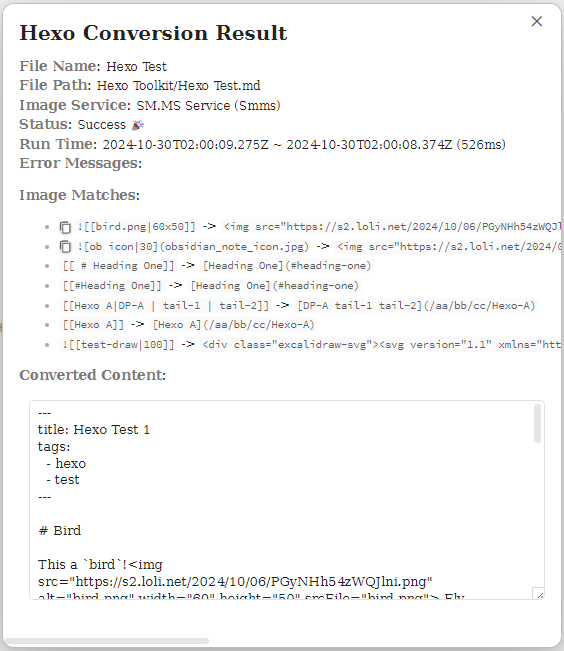
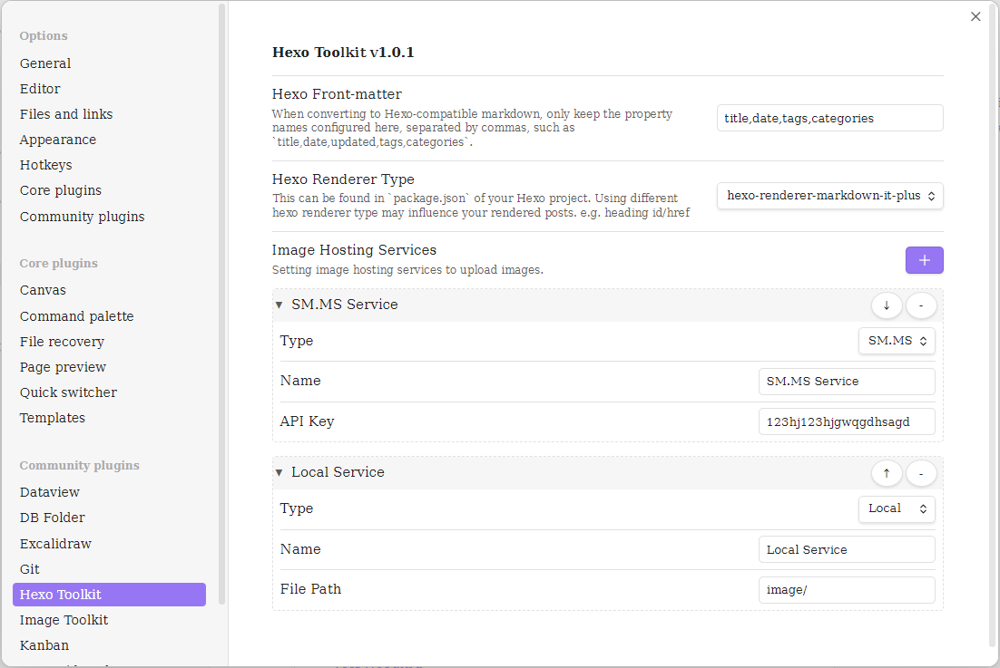

# Hexo Toolkit Plugin for Obsidian

**Hexo Toolkit** is an [Obsidian](https://obsidian.md/) plugin that helps users to manage their [Hexo](https://hexo.io/) posts, including converting notes to Hexo-compatible Markdown format.

# Features

## Conversion to Hexo-compatible Markdown

Users can write their posts in Obsidian and use this plugin to convert them to Hexo-compatible Markdown. Since Obsidian Markdown includes some special syntax not supported by Hexo, the plugin handles conversions as follows:

- [x] Extract Hexo [Front-matter](https://hexo.io/docs/front-matter) according to settings configured in the plugin
- [x] Convert internal title links (e.g. `[[# Chapter One]]`, ...): the conversion method will depend on the Hexo renderer type in use.
- [x] Convert image formats, e.g. `![[Engelbart.jpg]]`, `![[Engelbart.jpg|100x145]]`, ``, ...
- [x] Convert embedded Excalidraw images (e.g. `![[test.excalidraw]]`) to svg
- [x] Convert link to a file, e.g. `[[Hexo A]]` -> `[Hexo A](/aa/bb/cc/Hexo-A)` (The `/aa/bb/cc/Hexo-A` must be set `hexo-path: /aa/bb/cc/Hexo-A` within Obsidian properties.)

## Image Hosting Services

Users can set up Image Hosting Services to maintain the images of posts.

### Local

When you convert a post in Obsidian using **Local** image service, all local images in the post should be copied to Hexo manually.

You can open the 'Hexo Conversion Result' window and then copy those images by clicking copy button within Image Matches.

### Smms (SM.MS)

When you convert a post in Obsidian using **Smms (SM.MS)** image service, all local images in the post will be uploaded to SM.MS automatically.

# Usage

Open command palette (default `Ctrl/Cmd + p`) to search and execute `Hexo Toolkit: Convert`, the conversion completes successfully when you see `Hexo: Success 🎉` on the bottom-right status bar. And now, you can click this status and a 'Hexo Conversion Result' window will be popped up.

## Commands

- **Hexo Toolkit: Convert**: This command can only be executed within Markdown notes. Running it will convert the current active note to Hexo-compatible Markdown format. During the conversion, the status bar displays the current progress. Once completed, you can click the status bar to open a "Hexo Conversion Result" window with the conversion details.

# Screenshot

